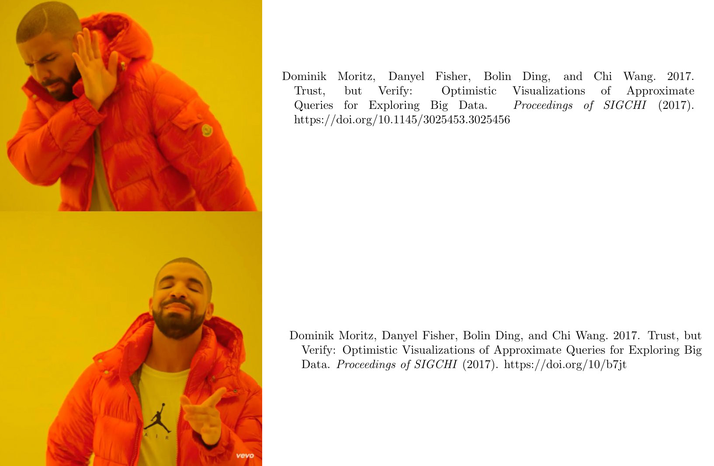

# shorty

<div style="text-align:center">
    </img>
</div>

A minimal Python script to shorten DOIs in bibtex files using http://shortdoi.org/. The shortener is offered by the [International DOI Foundation](https://www.doi.org/).

Use it with (or [follow long instructions below](#how-do-i-use-it))

```
curl -s https://raw.githubusercontent.com/domoritz/shorty/master/main.py | python /dev/stdin long.bib > short.bib
```

## What does it do?

It converts

```bib
@article{Moritz2017,
    doi = {10.1145/3025453.3025456},
	year = {2017},
	author = {Dominik Moritz and Danyel Fisher and Bolin Ding and Chi Wang},
	title = {Trust,  but Verify: Optimistic Visualizations of Approximate Queries for Exploring Big Data},
	journal = {Proceedings of SIGCHI}
}
```

to (notice the shorter DOI!)

```bib
@article{Moritz2017,
	doi = {10/b7jt},
	year = {2017},
	author = {Dominik Moritz and Danyel Fisher and Bolin Ding and Chi Wang},
	title = {Trust,  but Verify: Optimistic Visualizations of Approximate Queries for Exploring Big Data},
	journal = {Proceedings of SIGCHI}
}
```

## Why do I want to use it?

You may have a page limit or you just want your references to be shorter to fit on a single (or two, or three, or n) page. 

## How do I use it?

Download [the script](main.py). Then copy your bibtex file to a new file (here `demo.bib` but you can call it `long.bib`). Then run

```
python main.py demo.bib > short.bib
```

Alternatively, you can pipe in the the content

```
cat demo.bib | python main.py > short.bib
```
